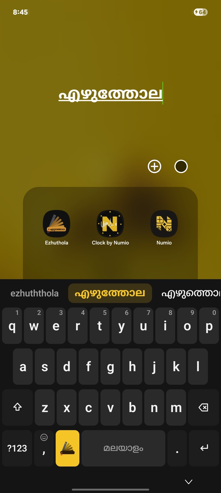
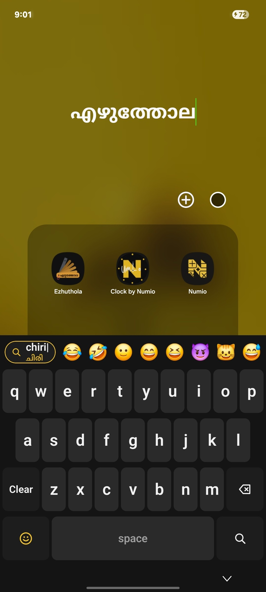
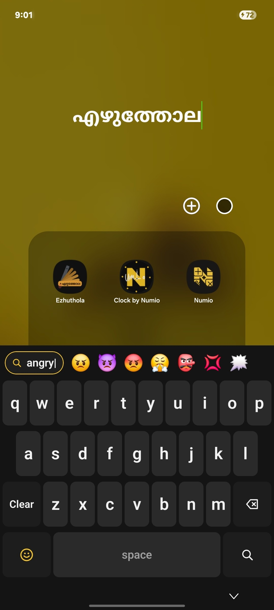
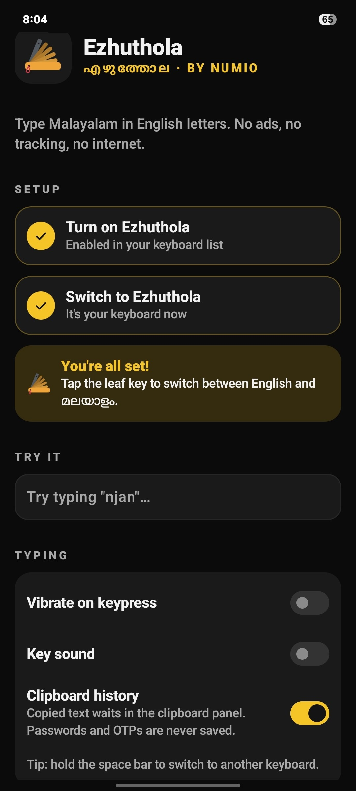
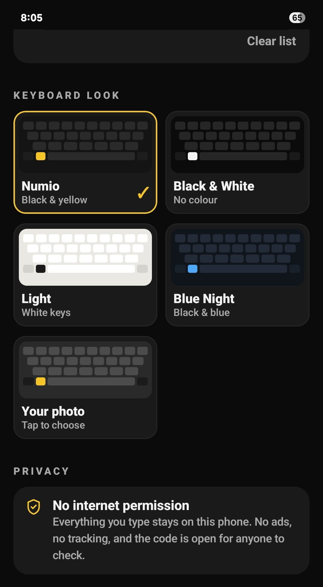

  

<h1 align="center">Ezhuthola — Malayalam Keyboard</h1>

  <b>Type Malayalam the way you text: in Manglish.</b> 
  Type <code>ente keralam</code> and get <b>എന്റെ കേരളം</b>. 
  No ads. No tracking. No internet. Just a keyboard.

  
  
  
  
  
  

Ezhuthola (എഴുത്തോല, the palm-leaf manuscript) is a free, open-source Malayalam keyboard for Android.
Part of [Numio](https://getnumio.org) — small, honest apps made by a Keralite.

---

## 🌴 Why Ezhuthola

Most Manglish keyboards are closed source, and many show ads or ask for internet access.
Ezhuthola is different:

- ✅ **No permissions at all.** Not even internet. Nothing you type ever leaves your phone.
- ✅ **No ads, no accounts, no tracking.** Ever.
- ✅ **Free and open source** (GPL-3.0). Anyone can read the code.

## ✨ Features

### മ Malayalam (Manglish)
- ✅ Type in English letters and get Malayalam: `njan` → ഞാൻ, `adipoli` → അടിപൊളി
- ✅ Its own transliteration engine, written from scratch in Kotlin
- ✅ Word suggestions ranked by how often Malayalam words are actually used
- ✅ Word forms with endings: `keralathil` → കേരളത്തിൽ, built from a real base word + ending
- ✅ Learns your words: the suggestions you pick come first next time

### 🔤 English
- ✅ Word suggestions and completion
- ✅ Autocorrect (`setteng` → setting) — press backspace to undo it
- ✅ Knows chat words like bro, tbh, ngl and lmao
- ✅ Leaves your Manglish alone (poda, adipoli…)
- ✅ Learns as you type; a **Missing words** list in settings shows what it learned

### 🧰 Everything else
- ✅ One tap to switch: the yellow **ola** key changes between Malayalam and English
- ✅ Emoji panel (hold the comma key) with **emoji search in English, Manglish and Malayalam** — try `love`, `chiri` or `ചിരി`
- ✅ Clipboard history: tap to paste, hold to pin or delete. Passwords and OTPs are never saved
- ✅ Two symbol pages, with ₹ on both
- ✅ Number hints on the top row
- ✅ Themes: Numio, Black & White, Light, Blue Night, or **your own photo** (with a dim slider)
- ✅ Vibration and key sound settings
- ✅ Hold the space bar to switch keyboards

## 📸 Screenshots

  
  
  
  
  

## 📲 Install

- **GitHub:** download the APK from [Releases](https://github.com/rag-creation/ezhuthola/releases)
- **F-Droid:** coming soon

Then:

1. Open **Ezhuthola** and follow the setup steps
2. Turn on Ezhuthola in **Settings → Keyboard list**
3. Choose Ezhuthola as your keyboard

Requires Android 8.0 (Oreo) or newer.

## 🔒 Privacy

Ezhuthola asks for **no Android permissions**. It cannot reach the internet, so it cannot send anything anywhere.
Learned words, pinned clips and settings are stored only on your phone, inside the app.
Uninstalling Ezhuthola removes all of it.

## 🛠️ Built with

- [Kotlin](https://kotlinlang.org) and [Jetpack Compose](https://developer.android.com/jetpack/compose)
- Android's InputMethodService
- Ezhuthola's own transliteration rules and engine (no external transliteration library)

## 🙏 Credits and licences

Ezhuthola stands on the work of these people and projects. Thank you.
Full details are in [CREDITS.md](CREDITS.md); full licence texts are in the [licenses](licenses/) folder.

| What | By | Licence | Used for |
|---|---|---|---|
| [FrequencyWords](https://github.com/hermitdave/FrequencyWords) (from [OpenSubtitles](https://www.opensubtitles.org/), 2018) | Hermit Dave | [CC BY-SA 4.0](https://creativecommons.org/licenses/by-sa/4.0/) | Malayalam and English word frequencies: `ml_words.tsv`, `en_words.tsv` (adapted, so also CC BY-SA 4.0) |
| [CMU Pronouncing Dictionary](https://github.com/cmusphinx/cmudict) | Carnegie Mellon University | [BSD 2-clause](licenses/CMUdict-BSD.txt) | How English words sound, so English typed in Malayalam mode is spelled the Malayali way (four → ഫോർ): `en_ml_words.tsv` |
| [ESDB / SCOWL](https://github.com/en-wl/wordlist) (size 60, American and British) | Kevin Atkinson | [ESDB licence](licenses/ESDB-SCOWL.txt) (MIT-like) | Spelling list: rare real English words are left alone, not "corrected": `en_known_words.txt` |
| [Unicode CLDR](https://github.com/unicode-org/cldr-json) annotations (CLDR 48, English and Malayalam) | Unicode, Inc. | [Unicode License v3](licenses/Unicode-License-v3.txt) | Emoji names and search keywords |
| [Unicode Emoji](https://github.com/unicode-org/unicodetools) `emoji-test.txt` (Emoji 17.0) | Unicode, Inc. | [Unicode License v3](licenses/Unicode-License-v3.txt) | Emoji list and order: `emoji_keywords.tsv` |
| [AndroidX](https://developer.android.com/jetpack/androidx) (Jetpack Compose, Material 3, Core, Lifecycle, Activity, Emoji2 Emoji Picker) | Google / The Android Open Source Project | [Apache 2.0](licenses/Apache-2.0.txt) | App and keyboard UI |

Ezhuthola's own work, under **GPL-3.0**:

- `ezhuthola_rules.json` — the Manglish → Malayalam transliteration rules
- `ml_extra_words.tsv` — common words the subtitle list misses, like place names (കേരളം, തൃശ്ശൂർ, ദുബായ്) and festivals
- `en_extra_words.tsv` — English chat words (bro, tbh, ngl…), app and phone words, and Kerala and UAE places
- `emoji_manglish.tsv` — Manglish emoji search words (pwoli, umma…)

Emoji images are drawn by your phone's own emoji font; none are bundled in the app.

Unicode and the Unicode Logo are registered trademarks of Unicode, Inc. in the United States and other countries.

## 📄 Licence

Ezhuthola is free software: you can redistribute it and/or modify it under the terms of the
[GNU General Public License v3.0](LICENSE).

The word-frequency lists adapted from FrequencyWords are shared under **CC BY-SA 4.0**, and the
emoji data under the **Unicode License v3**, as their licences require.

## 🤝 Contributing

Found a word that comes out wrong, or a word Ezhuthola doesn't know?
[Open an issue](https://github.com/rag-creation/ezhuthola/issues) — Manglish spellings are very welcome.

---

Built by RR with help from Claude · [Numio](https://getnumio.org) · Made by a Keralite 💛
